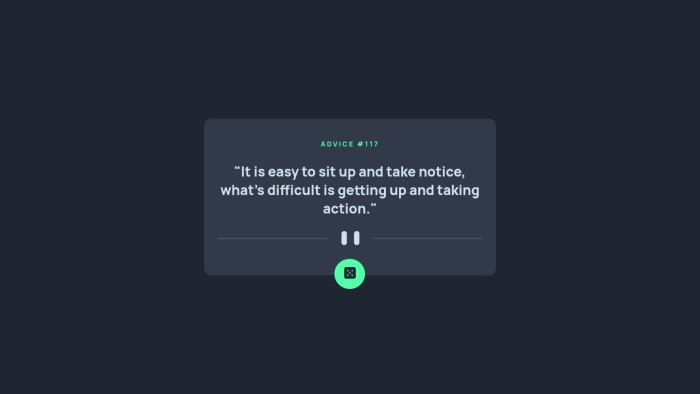

# Frontend Mentor - Advice generator app solution

This is a solution to the [Advice generator app challenge on Frontend Mentor](https://www.frontendmentor.io/challenges/advice-generator-app-QdUG-13db). Frontend Mentor challenges help you improve your coding skills by building realistic projects.

## Table of contents

- [Overview](#overview)
  - [The challenge](#the-challenge)
  - [Screenshot](#screenshot)
  - [Links](#links)
- [My process](#my-process)
  - [Built with](#built-with)
- [Author](#author)

## Overview

### The challenge

Users should be able to:

- 

### Screenshot

### Links

- Solution URL: [https://www.frontendmentor.io/solutions/advice-generator-app-using-scss-and-js-QIqJjCVZg](https://www.frontendmentor.io/solutions/advice-generator-app-using-scss-and-js-QIqJjCVZg)
- Live Site URL: [https://advice-generator-adithya.netlify.app/](https://advice-generator-adithya.netlify.app/)

## My process

### Built with

- Semantic HTML5 markup
- CSS custom properties
- Flexbox
- CSS Grid
- Mobile-first workflow
- SCSS

## Author

- Website - [Mohamad Adithya](https://www.m-adithya.my.id)
- Frontend Mentor - [@mohamadadithya](https://www.frontendmentor.io/profile/mohamadadithya)
- Twitter - [@mohamadadithya](https://www.twitter.com/mohamadadithya)
- Instagram - [@mohamadadithya](https://www.instagram.com/mohamadadithya)
