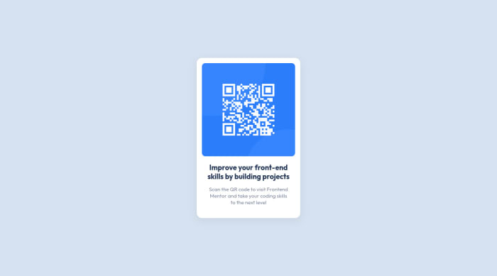

# Frontend Mentor - QR code component solution

This is a solution to the [QR code component challenge on Frontend Mentor](https://www.frontendmentor.io/challenges/qr-code-component-iux_sIO_H). Frontend Mentor challenges help you improve your coding skills by building realistic projects. 

## Table of contents

- [Overview](#overview)
  - [Screenshot](#screenshot)
  - [Links](#links)
- [My process](#my-process)
  - [Built with](#built-with)
- [Author](#author)

## Overview

### Screenshot

### Links

- Solution URL: [https://www.frontendmentor.io/solutions/qr-code-component-using-scss-yYYtLoSk9](https://www.frontendmentor.io/solutions/qr-code-component-using-scss-yYYtLoSk9)
- Live Site URL: [https://qr-code-adithya.netlify.app](https://qr-code-adithya.netlify.app)

## My process

### Built with

- Semantic HTML5 markup
- SCSS
- BEM Method
- CSS custom properties
- Mobile-first workflow

## Author

- Website - [Mohamad Adithya](https://m-adithya.my.id)
- Frontend Mentor - [@mohamadadithya](https://www.frontendmentor.io/profile/mohamadadithya)
- Twitter - [@mohamadadithya](https://www.twitter.com/mohamadadithya)
- Instagram - [@mohamadadithya](https://www.instagram.com/mohamadadithya)